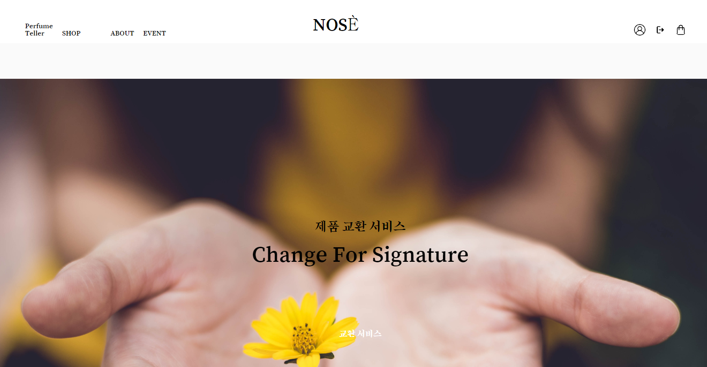
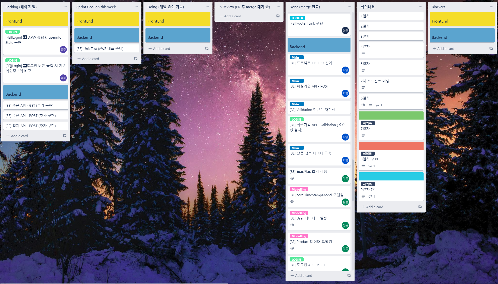
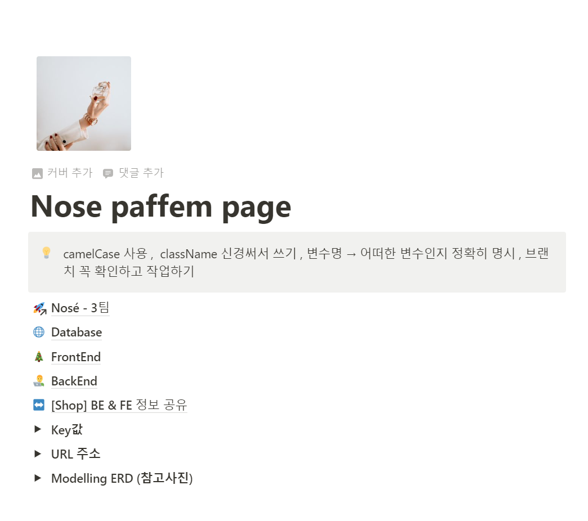

## ✅ 프로젝트 소개
---

   
  
   
  위 사진은 프론트엔드 구현 화면입니다.

📍 __설명__

해당 레포지토리는 [위코드 부트캠프](https://github.com/wecode-bootcamp-korea)의 34기 백엔드 1차 팀 프로젝트 레포지토리입니다.  

프론트엔드 레포지토리는 [여기](https://github.com/wecode-bootcamp-korea/34-1st-Nose-frontend)로 이동해주세요. 

 

📍 __목차__

1. 프로젝트 개요  

2. 기술 스택

3. 구현 기능

4. 배운 점 & 아쉬운 점

 
 

## ✅ 프로젝트 개요
---

해당 프로젝트는 [PAFFEM](https://paffem.cafe24.com/)이라는 향수 추천 웹사이트 중 일부 기능을 배우고 적용해보는 목적으로 진행되었습니다.

저작권 문제로 이미지는 [pixabay](https://pixabay.com/ko/)의 이미지들을 사용하였습니다.

협업 툴로는 `Trello`와 `Notion`을 사용하였습니다.

   
  
   
  Trello

   
  
   
  Notion

 

### 📌 프로젝트 목표

1. Python의 `Django` 프레임워크를 활용한 백엔드 서버 구축하기.

2. MySQL을 활용하여 데이터베이스를 구축하고, ORM 이해하기.

3. 다양한 협업 툴을 사용하여 커뮤니케이션 역량 강화하기.

4. Scrum 방식 업무 경험하기.

 

### 📌 팀원 소개 및 역할

해당 프로젝트는 2명의 백엔드 개발자가 참여하였습니다.

__김상웅 [sangwoong03](https://github.com/sangwoong03)__

- `dbdiagram`을 활용한 모델링

- `Django` 프로젝트 초기 설정

- 로그인 기능 및 `bcrpyt`, `pyjwt`를 회원 인증/인가 API 구현

- 상품 전체 및 상세 리스트 API 구현

 

__김지영 [KJY0627](https://github.com/KJY0627)__

- `dbdiagram`을 활용한 모델링

- MySQL 기본 데이터 구축 및 저장

- 회원가입 기능 및 `bcrypt`를 통해 암호화된 회원정보 DB 저장

- 장바구니 API 구현 - POST, GET, DELETE

 
 

## ✅ 기술 스택
---

기본 기술 스택은 다음과 같습니다.

`requirements.txt` 파일에서 프로젝트에 사용된 모듈 및 패키지의 버전을 확인할 수 있습니다.

 

### 📌 Backend 기술스택
| Language | Framwork |  Database |  ENV | HTTP  |
| :------: | :------: | :-------: | :--: | :--: |
|       |       | |  | 

 
 

## ✅ 구현 기능
---
이번 프로젝트에서 구현한 기능은 총 4가지입니다.

__1. 회원가입 API__

- 회원 정보에 대한 `유효성 검사 `

- 회원 비밀번호 `bcrypt` 암호화

 

__2. 로그인 API__

- `bcrypt`를 활용한 비밀번호 암호화/복호화

- `jwt`를 활용한 토큰 발급 및 토큰 인가

 

__3. 상품 API__

- `Shop` 페이지 이동 시 상품의 전체리스트 정보 불러오기
- `Qeury Parameter`로 특정 상품 필터링하기
- `Path Parameter`로 특정 상품 상세 정보 불러오기

 

__4. 장바구니 API__

- 상품 상세 페이지에서 해당 상품 장바구니에 추가하기 
- 로그인 한 유저의 장바구니에 담긴 상품 확인하기
- 로그인 한 유저의 장바구니에서 선택된 상품 삭제하기 